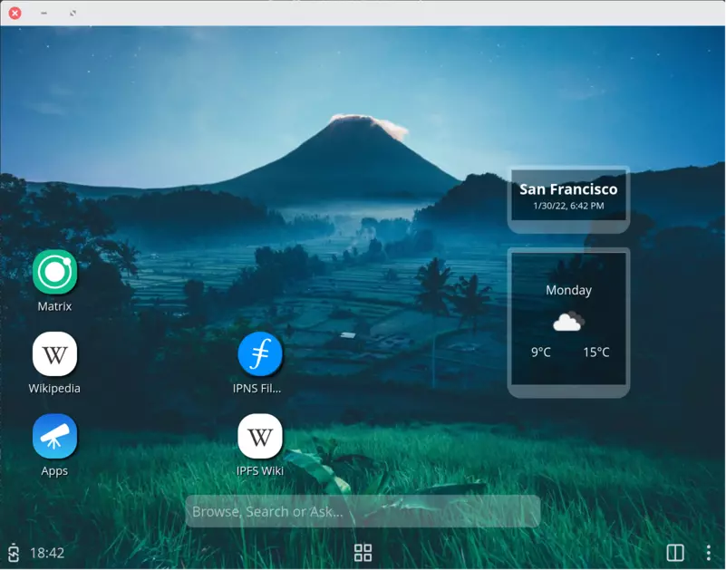

# Nutria: An Experimental Web Based OS Frontend

This repo contains a suite of apps and their build system. Several running mode are available:

- Gonk based devices (build from https://github.com/capyloon/B2G).
- Linux mobile form factor emulator.
- Linux desktop form factor.
- Linux desktop session.
- Linux TV, large screen form factor.

The included build system is available by running the `jackady` (spelled like the French "Jacques a dit") command. This lets you run locally in development or production mode, and manage device operations.

If you want to contribute, please read the [Contributing Guide](./docs/contributing.md) and [Debugging Guide](./docs/debugging.md).

[


](https://capyloon.org)

# Prerequisites

In order to develop locally, you need a stable Rust toolchain installed (eg. from https://rustup.rs/) since the first invocation of `jackady` will compile the build system.

Creating debian packages requires the `dpkg-deb` command from the `dpkg` package.

# Quick Start

Once your Rust toolchain is installed, you can get a running system with these 2 commands:

1. `./jackady update-prebuilts`
2. `./jackady dev`

You can then make changes to apps and see the results live, except for the system UI and the homescreen which require a restart.

# Build commands

Running `jackady` without arguments shows the list of available commands:

```
USAGE:
    jackady [OPTIONS] <SUBCOMMAND>

OPTIONS:
    -h, --help       Print help information
    -v, --verbose    Enable verbose output
    -V, --version    Print version information

SUBCOMMANDS:
    clean               Cleans up the output directory
    deb                 Desktop: creates a debian package
    dev                 Desktop: runs without packaging apps
    help                Print this message or the help of the given subcommand(s)
    install             Desktop: package the apps into a given directory
    new-app             Creates a new app based on a scaffolding template
    prod                Desktop: runs with packaged apps
    push                Gonk: push the packaged apps to the device
    push-b2g            Gonk: push Gecko to the device
    reset-data          Gonk: reset the user data on the device
    reset-time          Gonk: reset the time on device
    restart             Gonk: force a restart of the api-daemon and b2g
    update-prebuilts    Download prebuilt versions of the needed binaries
```

`jackady` also relies on some environment variables to be set to control its behavior:
| Variable | Description | Default value |
| ------------------------ | ----------------------------------------------------------------------------------------------- | ------------------------------------------ |
| NUTRIA_OUTPUT_ROOT | The path where build artefacts are created. | `./builder/output` |
| NUTRIA_API_DAEMON_ROOT | The path to a checkout of the [`api-daemon` crate](https://github.com/capyloon/api-daemon). | |
| NUTRIA_API_DAEMON_BINARY | The path to the `api-daemon` executable built for the desktop platform. | `./prebuilts/${HOST_TARGET}/api-daemon` |
| NUTRIA_API_DAEMON_PORT | The port on which the api-daemon should run. | 80 but needs to be set to 8081 on desktop. |
| NUTRIA_APPS_ROOT | The path to the apps directory. | `./apps` |
| NUTRIA_APPSCMD_BINARY | The path to the `appscmd` executable built for the target platform. | `./prebuilts/${HOST_TARGET}/appscmd` |
| NUTRIA_B2GHALD_BINARY | The path to a taget version of the `b2ghald` executable. Only required for debian packaging. | |
| NUTRIA_B2GHALCTL_BINARY | The path to a target version of the `b2ghalctl` executable. Only required for debian packaging. | |
| NUTRIA_B2G_BINARY | The path to the b2g binary used for running on desktop. | `./b2g` |
| NUTRIA_B2G_PACKAGE | The path to a b2g package that will be pushed to a device. | |
| NUTRIA_PREBUILTS_JSON | The path to a json file describing where to find prebuilts artifacts. | |
| NUTRIA_LINUX_USER | The username to use when connecting to a remote Linux device. | mobian |
| NUTRIA_LINUX_HOST | The hostname or ip of the remote Linux device | pinephone |
| NUTRIA_LINUX_DISABLED | Set this variable to any value to disable detection of Linux devices. | |

## The `clean` command

This removes all build artefacts from the selected output directory. Note that this includes all data from development and production profiles.

## The `deb` command

This will create a debian package under `NUTRIA_OUTPUT_ROOT/debian/`.

This package provides the desktop session, as well as the mobile & desktop simulators. Note that when installed from the debian package, they all share the same profile data.

The following options are supported:

```
USAGE:
    jackady deb [OPTIONS]

OPTIONS:
    -d, --device <DEVICE>    The target device [possible values: desktop, pinephone]
    -h, --help               Print help information
    -V, --version            Print version information

```

## The `dev` command

This command runs the desktop simulator in development mode: apps are not packaged, and changes done to them in the `NUTRIA_APPS_ROOT` directory are immediately visible when reloading the apps. Changes to the system app still require a full restart.

The following options are supported:

```
USAGE:
    jackady dev [OPTIONS]

OPTIONS:
    -d, --debug          Run under gdb if set
    -h, --help           Print help information
        --size <SIZE>    The screen size to emulate. Formatted such as 800x600
        --type <TYPE>    The type of device to emulate. Valid values are 'desktop' and 'mobile'
    -V, --version        Print version information
```

## The `prod` command

This command runs the desktop emulator in production mode, with apps packaged in zips.

The following options are supported:

```
USAGE:
    jackady prod [OPTIONS]

OPTIONS:
    -d, --debug          Run under gdb if set
    -h, --help           Print help information
        --size <SIZE>    The screen size to emulate. Formatted such as 800x600
        --type <TYPE>    The type of device to emulate. Valid values are 'desktop' and 'mobile'
    -V, --version        Print version information
```

## The `install` command

This command takes a mandatory parameter that is the path where the packaged apps will be written. This command is used by the Android build system.

## The `push` command

This command will push the specified apps to the device, effectively updating them. Two special cases are taken into account:

1. If the `system` app is updated, b2g and the api-daemon are restarted.
2. If the `homescreen` app is updated, the current running one is killed which triggers a reload.

The following options are supported:

```
USAGE:
    jackady push [APPS]

ARGS:
    <APPS>    An optional comma separated list of apps

OPTIONS:
    -h, --help       Print help information
    -V, --version    Print version information
```

## The `push-b2g` command

This command will push a new b2g runtime to the device.

The following options are supported:

```
USAGE:
    jackady push-b2g <PATH>

ARGS:
    <PATH>    The full path to the Gecko package (eg. /home/user/b2g-98.0.en-US.linux-android-
              aarch64.tar.bz2)

OPTIONS:
    -h, --help       Print help information
    -V, --version    Print version information
```

## The `reset-data` command

This command deletes all profile data used by b2g and the api-daemon on device.

## The `reset-time` command

This command set the device time to be the same as the current host.

## The `restart` command

This command forces a restart of b2g and the api-daemon.

## The `update-prebuilts` command

This command will fetch prebuilt binaries for your platform and setup environment variables accordingly.
The downloaded resources are cached in the `.cache` directory.

By default `jackady` uses the resources linked to in the [prebuilts.json](./builder/prebuilts.json) file.
It is also possible to use other prebuilt resources by setting the `NUTRIA_PREBUILTS_JSON` environement variable properly.

The following options are supported:

```
USAGE:
    jackady update-prebuilts [OPTIONS]

OPTIONS:
    -h, --help               Print help information
    -t, --target <TARGET>    The target for which to fetch binaries. Defaults to the current host
    -V, --version            Print version information
```

## The `new-app` command

This command will create a basic app with a manifest. The expected parameters are:

```
USAGE:
    jackady new-app <NAME>

ARGS:
    <NAME>    The new app name

OPTIONS:
    -h, --help    Print help information
```

# Using custom prebuilt binaries and porting to a new target

The `./jackady update-prebuilts` downloads and install a set of needed binaries:

- `b2g`, the web runtime. Built from https://github.com/capyloon/gecko-b2g/tree/capyloon
- `api-daemon`, a daemon used to expose non standard apis to web pages. Built from https://github.com/capyloon/gecko-b2g/tree/capyloon
- `ipfsd`, the local IPFS node. Built from https://github.com/capyloon/beetle/tree/capyloon
- `b2ghald`, a daemon to control some low level apis (eg. screen brightness) on Linux. Built from https://github.com/capyloon/b2ghald

Prebuilts are currently provided for a number of architectures: `x86_64-unknown-linux-gnu`, `aarch64-unknown-linux-gnu`, `x86_64-apple-darwin` and `aarch64-apple-darwin`.

If you want to test a custom version of one of these binaries or build them for a different targets, you can follow similar steps as the shipped prebuilts that are all cross-compiled from a Ubuntu x86_64 host.

## b2g

You first need to create a `mozconfig` file with target specific changes. It is very likely that you can base yours on one of the existing mozconfig:

- `mozconfig-b2g-mobian` targets `aarch64-unknown-linux-gnu` for PinePhone and Librem5.
- `mozconfig-b2g-desktop` and `mozconfig-b2g-optdesktop` configure debug and release builds for `x86_64-unknown-linux-gnu`.
- `mozconfig-darwin-*` are cross-compilation setup for MacOS.

Here's an example shell script to drive a debug x86_64 build:

```shell
#!/bin/bash

export MACH_BUILD_PYTHON_NATIVE_PACKAGE_SOURCE=none

export PATH=$HOME/.mozbuild/clang/bin:$PATH

export RUSTUP_TOOLCHAIN=stable

export MOZCONFIG=./mozconfig-b2g-desktop
export MOZ_OBJDIR=./obj-b2g-desktop/

./mach build $1
```

This will provide a b2g binary in `${MOZ_OBJDIR}/dist/bin/b2g`.

## api-daemon

Check https://github.com/capyloon/api-daemon/blob/main/daily.sh to add a new target.

The binary will be under ./target/$TARGET_TRIPLE/release/api-daemon

## ipfsd

Check https://github.com/capyloon/beetle/blob/capyloon/daily.sh to add a new target.

The binary will be under ./target/$TARGET_TRIPLE/release/iroh-one

## b2ghald (optional, even on Linux)

Check https://github.com/capyloon/b2ghald/blob/main/daily.sh to add a new target.

The binary will be under ./target/$TARGET_TRIPLE/release/b2ghald

## Using the new binaries

To use the new binaries, once you have run `./jackady update-prebuilts` you can edit the file `./prebuilts/env` and set the values of the following environement variable to match the paths to your binaries:

- NUTRIA_B2G_BINARY
- NUTRIA_API_DAEMON_BINARY
- NUTRIA_IPFSD_BINARY
- NUTRIA_B2GHALD_BINARY

Happy hacking!
