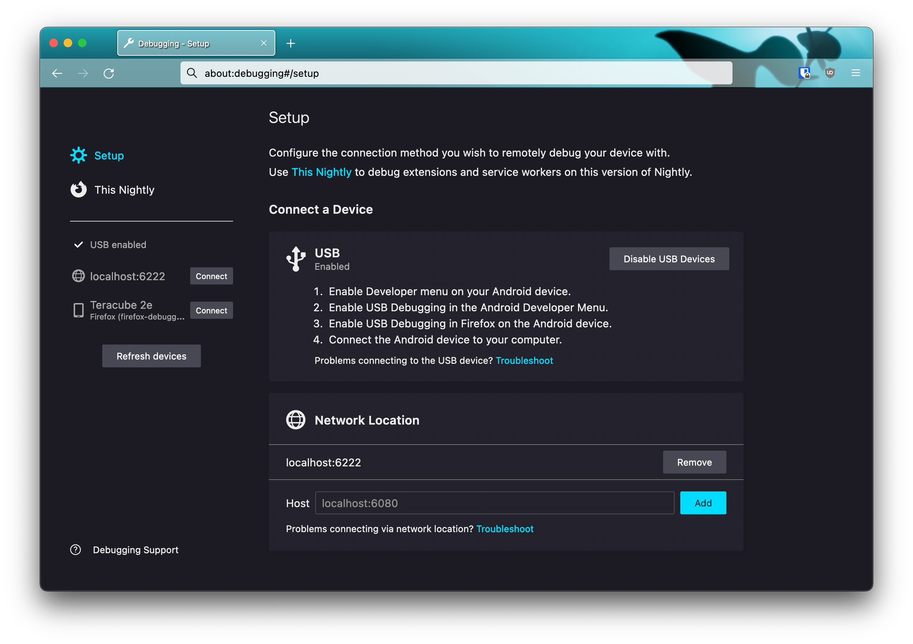
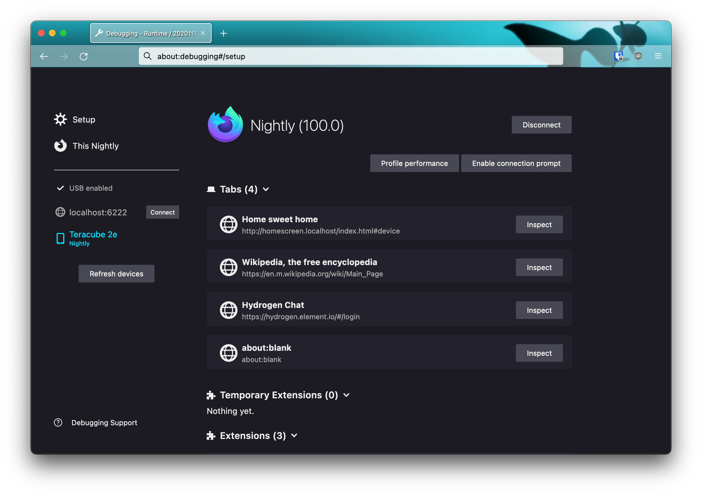
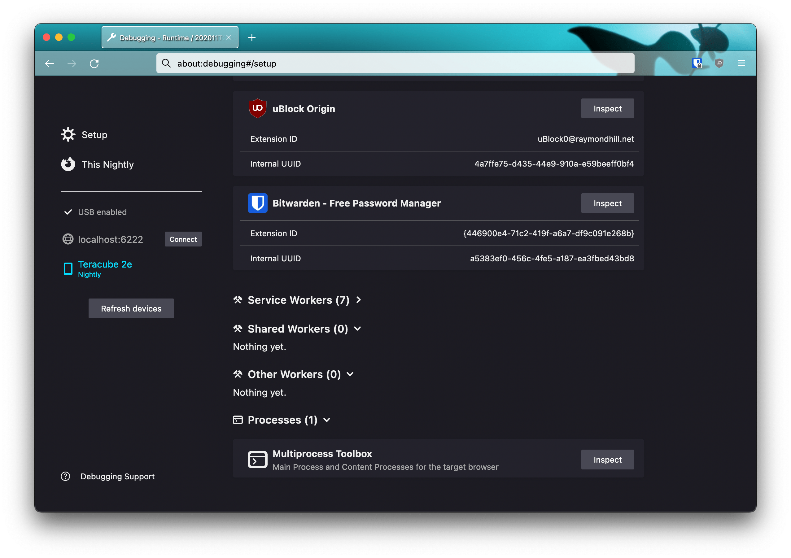

# Setting up the debugger

A Nutria instance behaves like a remote runtime, so all you need to debug apps are the Firefox devtools in remote debugging mode. Because the Gecko version used by Nutria is regularly updated, you need to use [Firefox Nightly](https://www.mozilla.org/en-US/firefox/channel/desktop/) as the debugger to keep both sides of the remote debugging protocol at a compatible version.

There are only limited differences depending on whether you are using a desktop or a device build. In all cases, open [about:debugging](about:debugging) in Firefox to access the developer tools.

## Desktop builds

The remote debugger listen on port 6222, so you can connect to a local instance as the default remote device.

## Gonk device builds

Gonk devices are recognized in Firefox devtools as Android devices. You need to [setup ADB](https://www.xda-developers.com/install-adb-windows-macos-linux/) for the host machine and enabled USB debugging in the devtools. Your device will then appear on the left side.

## Linux phones

These devices don't rely on ADB, but can be debugged like the desktop builds: simply add a new Network Location in the devtools setup, using either the IP address of your device or a name that resolves to it.

# Debugging apps

On desktop builds, it is recommended to run in dev mode to be able to hot reload apps and see changes applied. For that you need to run with the `./jackady dev` command.

On devices, you need to push the new version to the device with `./jackady push <appname>` and re-launch the app.

Apps are seen in the devtools as Tabs, and will appear as such in the devtools UI. Figuring out which app is which should be obvious from the title and url. If you see an "about:blank" url, it is very likely the pre-created tab used by the virtual keyboard, waiting to lazy load the actual content.

One exception is the system UI app: it is listed as the entry in the "Multiprocess Toolbox" after the workers section. Note that there is currently a bug that prevents console messages to show up for the system app.

Once in a devtools tab for a given app, all devtools features are available.

# Reloading apps

On desktop, all apps except the homescreen and system UI can be reloaded with the <kbd>Ctrl</kbd> + <kbd>R</kbd> key shortcut, or from the page info accessible by tapping on the page favicon.

The homescreen can be reloaded from the devtools themselves, or by killing the process from the command line.

The system UI can't be reloaded without a full gecko restart:
- On desktop, stop the `./jackady dev` command and relaunch it.
- On devices, pushing the system, homescreen or shared apps will take care of restarting the apps as needed.
